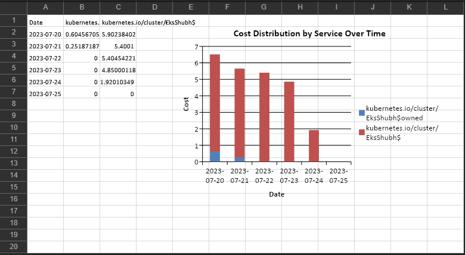

# Project

Amazon Cost Analysis

# Description

This lambda function fetches cost for specific services from cost explorer service and then it generates a bar graph daily with services vise stacked chart.

# AWS Services Used

- AWS Lambda
- AWS Cost Explorer
- AWS Simple Email Service
- AWS EventBridge Services

# Output

# Steps For Project Setup

- Setup AWS Simple Email Service
  1.  Open Aws console and open AWS SES
  2.  click on **Verified Identities**
  3.  create new identity for email and verify your email
- Setup New AWS IAM Role
  1.  Go to AWS IAM in AWS console
  2.  click on Roles
  3.  Create new Role for Aws Service Lambda
  4.  Create new policy with policy given file : **CE_SES_Policy.json**
  5.  Add these permissions : **AmazonLambdaBasicExecution**
- Add dependencies for python project
  1.  Clone requirements.txt
  2.  Create new python virtual environment
      `python -m venv venv`
  3.  Activate the virtual env
      `./env/Scripts/activate`
  4.  Install dependencies
      `pip install -r requirements.txt -t ./python`
  5.  Zip the dependencies
      `zip -r python.zip ./python`
- Setup AWS Lambda Function
  1.  Create new Lambda Layer
  2.  Upload the python.zip file for Lambda Layer
  3.  Create lambda function with above IAM newly created role
  4.  Copy lambda_function.py file in lambda function
  5.  Add newly created layer to function
- Setup trigger for lambda function
  1.  Add Eventbridge as new trigger for the function
  2.  Setup Cron job
